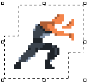
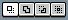
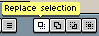
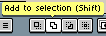
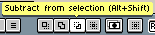
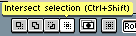

# Selecting

You can select parts of the sprite using one of the selection tools
e.g. the Marquee Tool  (<kbd>M</kbd> key),
and then [move it](move-selection.md) or [transform it](transformations.md)
([scale](resize.md), [rotate](rotate.md), etc.). When you select a
portion of the sprite, you will see a
[marching ants](https://en.wikipedia.org/wiki/Marching_ants) effect:

When you make a selection, you are selecting the active [cel](cel.md),
so all transformation will be made to that specific cel only.

## Add/Subtract/Intersect

In the [context bar](context-bar.md) you can find a set of modifiers that
change what to do with the selected region: 

By default, when you press the left mouse button, drag it, and then
release it, it will replace the whole selection. But you can modify
this behavior with the other options (each option has a keyboard
shortcut):

* : Default operation, replace the whole selection with the new one (drag left mouse button)
* : Creates a union between the existing selection a the new one (drag left mouse button + <kbd>Shift</kbd> key)
* : Subtracts the new selection to the existing one (drag left mouse button + <kbd>Alt+Shift</kbd> key, or alternative: drag right mouse button)
* : Intersects the existing selection with the new one (drag left mouse button + <kbd>Ctrl+Shift</kbd>)

These keys can be customized from the [*Edit > Keyboard Shortcuts > Action Modifiers*](keyboard-shortcuts.md#action-modifiers).

## Select Content

You can select:
- Entire sprite canvas using *Select > All* (<kbd>Ctrl+A</kbd>
or <kbd>⌘A</kbd>)
- Active [cel](cel.md) bounds
using *Edit > Transform* (<kbd>Ctrl+T</kbd> or <kbd>⌘T</kbd>)
- Active frame content (non-transparent pixels) using <kbd>Ctrl+Left click</kbd> on a layer (keyboard shortcuts for Add/Subtract/Intersect modifiers can be applied)

## Deselect and reselect

You can hide the current selection using *Select > Deselect*
(<kbd>Ctrl+D</kbd> or <kbd>⌘D</kbd>). Then you can make it appear again using
*Select > Reselect* (<kbd>Ctrl+Shift+D</kbd> or <kbd>⇧⌘D</kbd>).

## Invert

You can invert the selection using
*Select > Invert* (<kbd>Ctrl+Shift+I</kbd> or <kbd>⇧⌘I</kbd>).

---

**SEE ALSO**

[Transformations](transformations.md) |
[Move Selection](move-selection.md)
