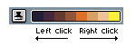
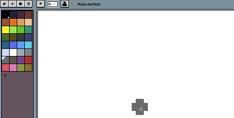
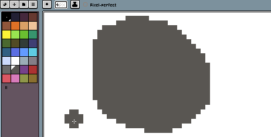
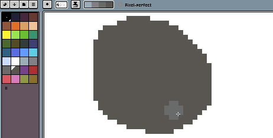
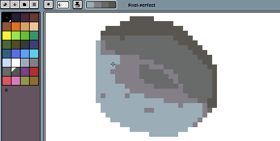

# Shading

The shading [ink](ink.md) can be used to create shadows in our sprites. We can
use left and right click to move colors between a gradient (given by
the selected colors in the [color bar](color-bar.md)):

The steps to use this ink are:

First of all we draw something to add light or shadows with a base
color:

Then we select the "Shading" ink mode, and select a set of colors from
the palette, including the previously selected base color. This
gradient will act as shadows and light:

You can use left click to move colors to the left of the gradient:

Or you can use right click to move colors to the right:

---

**SEE ALSO**

[Drawing](drawing.md) |
[Ink](ink.md)
