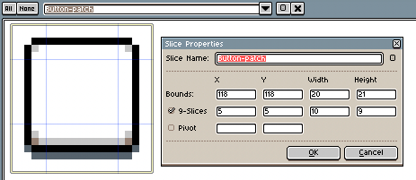

# Slices

With the Slice tool 
(<kbd>Shift+C</kbd> key) you can indicate regions of your sprite and
assign a name/label to that region with some extra user defined
information. There is support to specify
[9-slices](https://en.wikipedia.org/wiki/9-slice_scaling)/9-patches
information.

With this tool you can:

1. Create a new slice marking a rectangular region pressing the mouse
   button, dragging the mouse, and releasing the button.
1. If the marked rectangle touches existing slices, those slices will
   be selected.
1. You can drag-and-drop a set of selected slices to move them to
   other place. Or you can resize the whole set of slices dragging
   from the corners or edges.
1. After selecting some slices you can delete them pressing the Delete
   key or *Edit > Delete* menu option.
1. Double-clicking a slice you will see the [Slice
   Properties](#slice-properties) dialog.

## Slice Properties

If you double-click a slice, you will see its properties:



Here you can specify:

1. the bounds of the slice in the canvas
1. a 9-slices property to specify an internal rectangle to sub-divide the bounds into sub-slices
1. a pivot to specify the central/base location of the sprite inside the slice

## Exporting Slices

You can export each slice as a different sprite using the
[--split-slice option](cli.md/#split-slices).

You can also export the slice information in a sprite sheet JSON using
the [--data option](cli.md/#data) or the *File > Export Sprite Sheet*
menu option with the JSON output checked. This is an example of the exported data:

```json
{ ...
 "meta": {
  ...
  "slices": [
   { "name": "Button-patch",
     "color": "#0000ffff",
     "keys": [{ "frame": 0,
                "bounds": {"x": 118, "y": 118, "w": 20, "h": 21 },
                "center": {"x": 5, "y": 5, "w": 10, "h": 9 } }] }
  ]
}
```

---

**SEE ALSO**

[Drawing](drawing.md)
