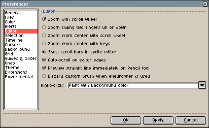

# Sprite Editor

The sprite editor is the first thing you will see when you create a
[new sprite](new-sprite.md):

On the sprite editor you can:

1. [Draw](drawing.md) with mouse clicks or a stylus/pen, or with one
   finger on a Windows Surface device.
1. [Zoom](zoom.md) with the mouse wheel or with a pinch-like gesture
   on a MacBook trackpad or the Windows Surface screen.
1. You can also scroll/pan with the mouse wheel and <kbd>Shift</kbd> key, or
   using two fingers in the MacBook trackpad or on Windows Surface
   screen.

### Preferences

There are a lot of things of the Sprite Editor that can be customized
from *Edit > Preferences > Editor* like:

* *Zoom with the wheel*: Checked by default, you zoom with the mouse
  wheel (if you uncheck this, the vertical scroll will be the default
  action for the mouse wheel)
* *Zoom sliding two fingers up or down*: This is available on macOS
  only, and if you enable it you will be zoom using two fingers in
  your MacBook trackpad.
* *Zoom from center with scroll wheel*: Check this if you want to [zoom](zoom.md)
  from the center of the sprite editor instead zooming from the mouse
  position when the mouse wheel is used.
* *Zoom from center with keys*: Zoom from the center of the sprite
  instead of the mouse position when we use the keys [to zoom](zoom.md) <kbd>1</kbd>, <kbd>2</kbd>, <kbd>3</kbd>, etc.
* *Show scroll-bars in the sprite editor*: Uncheck to hide the scroll bars.
* *Auto-scroll on editor edges*: With this option checked, when you
  are [drawing](drawing.md) (have the mouse button pressed) the mouse
  touches the edges of the sprite editor, it will scrolls
  automatically.
* *Preview straight line immediately on Pencil tool*: When you use the
  Pencil tool, pressing the <kbd>Shift</kbd> key will draw a straight line from
  the last painted point. With this option checked, you will see the
  line preview immediately after pressing the <kbd>Shift</kbd> key (instead of
  waiting for the mouse button). If this is too annoying for you, you
  can uncheck the option.
* *Discard custom brush when eyedropper is used*: If you create a
  custom brush with *Edit > New Brush* option, using the eyedropper
  
  tool will change the color of your brush. Checking this option,
  after picking a color with the eyedropper, the custom brush will be
  completely discarded and a a regular brush with the picked color
  will be selected.
* *Right-click behavior*: you can customize what action to do with the
  [right-click](right-click.md).

---

**SEE ALSO**

[Sprite](sprite.md) |
[Timeline](timeline.md) |
[Workspace](workspace.md) |
[Basics](basics.md)
