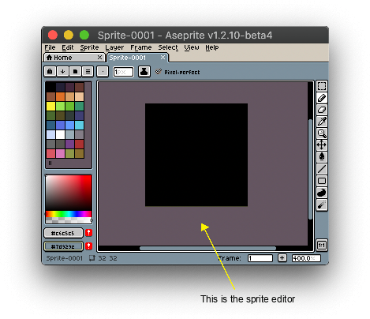

# Sprite Editor

The sprite editor is the first thing you will see when you create a
[new sprite](new-sprite.md):

On the sprite editor you can:

1. [Draw](drawing.md) with mouse clicks or a stylus/pen, or with one
   finger on a Windows Surface device.
1. [Zoom](zoom.md) with the mouse wheel or with a pinch-like gesture
   on a MacBook trackpad or the Windows Surface screen.
1. You can also scroll/pan with the mouse wheel and <kbd>Shift</kbd> key, or
   using two fingers in the MacBook trackpad or on Windows Surface
   screen.

### Preferences

You can customize the Sprite Editor behavior from [*Edit > Preferences > Editor*](preferences.md#editor).

---

**SEE ALSO**

[Sprite](sprite.md) |
[Timeline](timeline.md) |
[Workspace](workspace.md) |
[Basics](basics.md)
