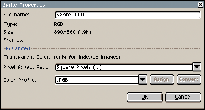

# Sprite Properties

You can change some sprite properties from *Sprite > Properties* menu (<kbd>Ctrl+P</kbd> or <kbd>⌘P</kbd>):

You can:

* Change [transparent color](transparent-color.md) (for [indexed color mode](color-mode.md#indexed))
* Change pixel aspect ratio
* Assign or convert the color profile [color profile](color-profile.md)

## Color Profile

In the *Sprite Properties* dialog you have two buttons: one to **Assign** other
color profile, and other to **Convert** to other color profile:

* If you **Assign** a new color profile to the sprite, pixel values
  will not be modified, just the new color profile is assigned to the
  sprite. You will notice that colors will change in the picture
  because now RGB values are the same, but the [color space](color-profile.md)
  has changed. E.g. so now, the "pure red" value (255, 0, 0), might be
  different that the previous "pure red").
* If you **Convert** the color profile, pixel values will be converted
  from one color space to the other color space, so colors should not
  be visually different, but each RGB value will be adjusted to the
  new color space (so almost all pixel values will be modified).

---

**SEE ALSO**

[New Sprite](new-sprite.md) |
[Color Profile](color-profile.md) |
[Transparent Color](transparent-color.md)
