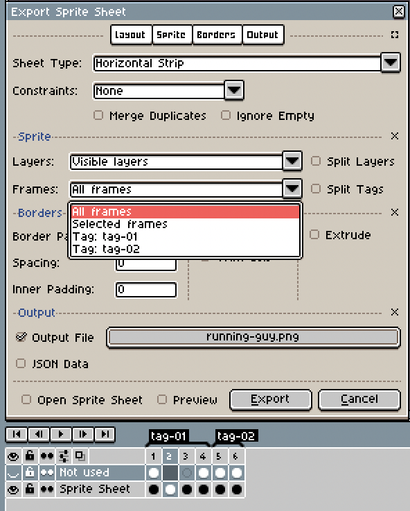

# Sprite sheets

A sprite sheet is one big image with several frames of the same sprite
on it. For example, you can save this animation:

Like an horizontal sprite sheet:

A vertical one:

Or a matrix:

In the following section you will know how to export and import this
kind of images into Aseprite.

## Import

To import a sprite sheet use *File > Import Sprite Sheet* option.
Then you can select the file to import with an assigned offset `x`,
`y` and sprite `width`, `height`.

Padding is available if there are gaps between sprites,
and the sheet type will affect the order of the sprites taken in.

## Export

To export a sprite sheet use *File > Export Sprite Sheet* option.
You can select all visible layers or a certain layer,
and select the frames based on tags.

## Automate from Command Line

(*Work-in-progress*)

## Texture Atlases

A texture atlas is an huge image with all the graphics, sprites and
images that a game will use. It's called "texture" because the image
can be loaded into the video memory, to render graphics on screen with
hardware acceleration.
