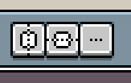
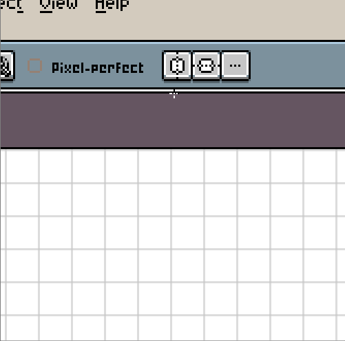
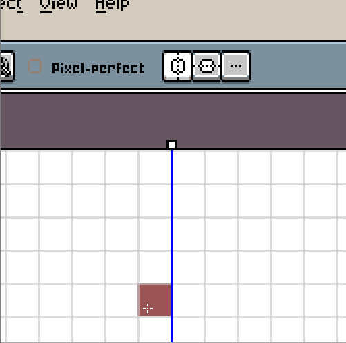
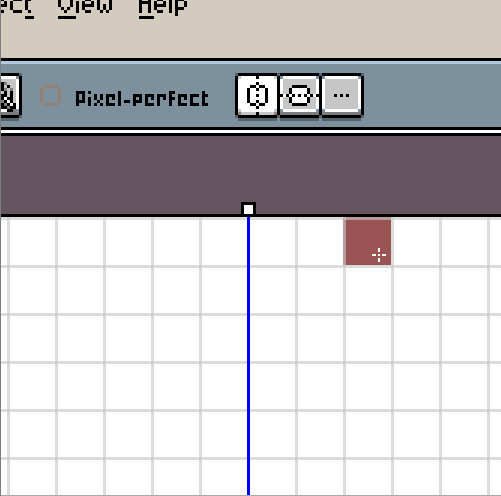

# Symmetry

To paint symmetrical sprites, you can use the Symmetry options available
from from *View > Symmetry Options* menu. This will show you
the following buttons in the [context bar](context-bar.md):

*  Enables
  the Horizontal Symmetry
*  Enables the
  Vertical Symmetry
*  Shows a popup
  menu with a *Reset Symmetry to Center* option

When you enable one symmetry axis (e.g. horizontal symmetry/vertical
axis) you can drag-and-drop on-screen handles to configure the
position of the axis:

Then just drawing will paint in both sides of the image:

You can put the axis in the middle of a pixel if you need to:

---

**SEE ALSO**

[Drawing](drawing.md)
