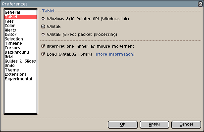

# Tablet

## Windows

Since Windows 8, Microsoft introduced a new API to use your tablet
with Windows programs: the pointer API. Since Aseprite v1.2.19.1 you
can configure what API do you prefer to use:



* *Windows 8/10 Pointer API*: This option might be enough for most
  modern devices, you can give a try how your tablet works with this
  (might work better with this option than with Wintab)
* *[Wintab](wintab.md)*: This is the default option at the moment to
  support pressure sensitivity on older systems (Windows Vista/7) and
  older devices.
* *Wintab (direct packet processing)*: This option might not work well
  in some devices, but might be useful in other devices to avoid
  losing packets and getting smoother strokes.

Pressing the *OK*/*Apply* buttons will change the tablet settings
immediately, there is no need to restart the program.

## Linux/X11

It looks like tablet/stylus/pen devices are detected by device
name/brand name on X11, instead by device capabilities.

There are some pre-defined IDs to detect a stylus, but it might not be
enough (as it's indicated in
[#3176](https://github.com/aseprite/aseprite/issues/3176))

If Aseprite doesn't detect the pressure of your pen, since **Aseprite
v1.2.35** you can try to do these steps:

1. Close Aseprite
2. Run `xinput --list` in a terminal/console
3. Check the output and see what device could be the one related to
   your stylus ([output example](https://github.com/aseprite/aseprite/issues/3176#issuecomment-1111799083))
4. Open `aseprite.ini` file in the [preferences folder](preferences-folder.md)
5. Search the `[general]` section and add the name of your stylus in a
   `x11_stylus_id` option (the name must appears just like in the
   first column of the `xinput --list` output):
```
[general]
x11_stylus_id = Your Stylus Name
```
6. Save the file and start Aseprite

Please inform us if this does work for your case adding a new comment
in [#3176](https://github.com/aseprite/aseprite/issues/3176)
indicating the name of your device.

---

**SEE ALSO**

[Wintab](wintab.md) |
[Troubleshooting](troubleshooting.md)
