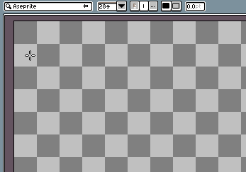

# Text Tool & Insert Text

The Text Tool and Insert Text option are two different ways to create text in Aseprite. They share mostly the same options, with the Text Tool having a few more than Insert Text. The Text Tool can be accessed with <kbd>T</kbd> and the Insert Text menu can  

## Font selector

Picks the font to use for the text. Clicking on the selector opens a dropdown with the installed system fonts. Clicking "Load External Font" loads a font from a file.

## Font size

Changes the font size. Depending on the font, some font sizes may have the `*` symbol next to them, indicating that the size is to pixel scale with the font.

## Font formatting

Changes the font formatting. Options:

* **Font Weight (bold)** - Sets the font weight.
* **Italic** - Toggles italics.

* **Antialias** - Toggles antialising, which smoothes out the text.
* **Hinting** - Toggles hinting, which aligns the font to the pixel grid.
* **Ligatures** - Toggles ligatures.
* **Fill** *(Text Tool only)*: Draws the font as a solid color. 
* **Stroke** *(Text Tool only)*: Draws the font as an outline.

    

* **Stroke Width** *(Text Tool only)*: Controls the stroke width. 

## Color (Insert Text only)

The color of the text. In the Text Tool, the foreground color is used instead.