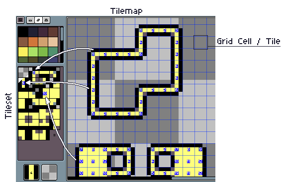
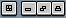
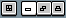
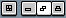

# Tilemap

Since **Aseprite v1.3** you can create *tilemaps* with *tilesets*.

What is a **tilemap**? A tilemap is a special kind of layer where each grid cell on the canvas is a reference to a tile (a little image) in its *tileset*. You can create a new tilemap from *Layer > New > New Tilemap Layer* or pressing <kbd>Space+N</kbd>.

What is a **tileset**? As its name says, it's a set of tiles, just like the color palette which is a set of colors. Each tile has an index and can be re-used in different position in the canvas on each tilemap grid cell.

Example:

## Similarities with Indexed Color

We can compare a tilemap with an [indexed image](color-mode.md#indexed):

| Tilemaps | Indexed Color
| -------- | -------------
| **Tile**: One little image that can be reused in several places of a Tilemap Layer | **Palette entry**: One RGBA color that can be reused in several places of an Indexed Image.
| **Tileset**: A collection of tiles of the same size. | **Palette**: A collection of RGBA colors (palette entries).
| **Tilemap Layer**: A 2D image where each pixel is a “tile index” that references a tile in the tileset. Each tilemap has a specific tileset associated. | **Indexed Image**: A 2D image where each pixel references a palette entry with an index.
| **Tile Index**: A value from 0 to N (where N=number of tiles in the tileset, and 0 is the *empty tile*) | **Palette Index**: A value from 0 to N-1 (where N=number of palette entries)

## Modes

When you are in a Tilemap Layer, there are 2 main modes, you can switch between these modes pressing <kbd>Space+Tab</kbd>:

| Mode |   | Description
| ---- | - | -----------
| *Draw Pixels* |  |  Draws pixels in each tile, i.e. modifies the tile content/pixels. This is like when you modify regular layers (you modify pixels). |
| *Draw Tiles* |  | Puts/gets tiles directly (doesn't modifying tiles content, modifies the tilemap information) |

When we draw pixels in a tilemap, we are modifying the content of each
tile, but there are three special modes that indicate how we should
handle these modifications between tiles:

| Draw Pixels  |   | Description
| ------------ | - | -----------
|  | *Manual* | It will modify each tile content, without re-ordering the tileset. Useful if you have already a fixed tileset and don’t want to change the position of each tile in the tileset. <kbd>Space+1</kbd>
|  | *Auto* | It tries to create new tiles (or reuse existing tiles) when you draw, and will erase unused tiles if they are not found in any tilemap referencing the tileset. It’s the default mode because it tries to simulate a regular layer adjusting the whole tileset automatically. <kbd>Space+2</kbd>
|  | *Stack* | It will create a new tile for each modification that is done in an existing tile, without modifying existing tiles, and stacking all the new ones. <kbd>Space+3</kbd>

---

**SEE ALSO**

[Color Mode](color-mode.md) |
[Layers](layers.md)
