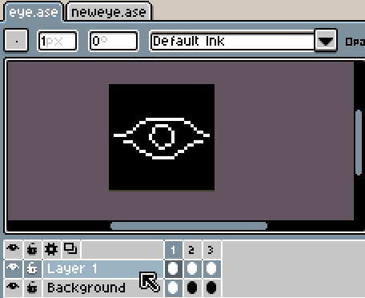

# Timeline

This is the timeline:

It shows the layers and frames of the active sprite. You can press the
`Tab` key to show or hide it. Also it appears automatically when you
create a new Frame or Layer. (This behavior can be disable
from *Edit > Options > General > Show timeline automatically*.)

You can use *Layer > New Layer* menu (`Shift+N`) to create new layers
or *Frame > New Frame* menu (`Alt+N`) to add frames.

### Common Operations

[Layers](layers.md):
* [Move layers](move-layers.md)
* [Copy layers](copy-layers.md)

[Frames](animation.md):
* [Move frames](move-frames.md)
* [Copy frames](copy-frames.md)

[Cels](cel.md):
* [Move cels](move-cels.md)
* [Copy cels](copy-cels.md)

## Copy between documents

You can copy and paste layers, frames, or cels between different
documents using *Edit > Copy* and *Edit > Paste*.

### Onion Skinning

See the [Onion Skinning](onion-skinning.md) section.

---

**SEE ALSO**

[Animation](animation.md) |
[Layers](layers.md) |
[Cel](cel.md)
