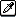

# Tool Bar

The tool bar contains several tools that you can use for different purposes:

* [Paint](drawing.md) 
* [Pick colors](eyedropper.md) 
* [Zoom](zoom.md) 
* [Select and transform regions](selecting.md) 
* [Show Timeline](timeline.md) 
