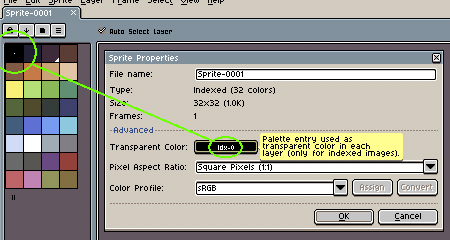

# Transparent Color

In [RGB](color-mode.md#rgb) and [Grayscale](color-mode.md#grayscale)
sprites, transparent pixels are colors with `Alpha=0`, but in
[Indexed](color-mode.md#indexed) color mode, there exist one specific
and special index in the palette that will represent the transparent
color for [transparent layers](layers.md#transparent-layers):

This means that pixels that refer to this specific index in the layer
will not be visible (and only the background layer can show the
"transparent color" as a solid color).

You can change the transparent color using middle mouse button in the
[color bar](color-bar.md), or
going to [*Sprite > Properties*](sprite-properties.md) menu option.

---

**SEE ALSO**

[Color](color.md) |
[Color Mode](color-mode.md) |
[Sprite Properties](sprite-properties.md)
