# Article - The Color Bar and Palettes

This article will explain the color bar and palettes, covering everything from the very basics to more niche/advanced features, like sprite color modes and color wheel picker types.

> A note to the reader: because GIFs have a limit of 256 colors, color pickers/gradients shown will look compressed.

### Table of Contents

* [What is the Color Bar?](#what-is-the-color-bar)
    * [What are the foreground/background colors?](#what-are-the-foregroundbackground-colors)
    * [What is the palette?](#what-is-the-palette)
    * [What is the color picker?](#what-is-the-color-picker)
* [Using the Color Picker and Foreground/Background Colors](#using-the-color-picker-and-foregroundbackground-colors)
* [Changing the Color Picker Type](#changing-the-color-picker-type)
  * [Color Wheel Harmonies and Discrete Mode](#color-wheel-harmonies-and-discrete-mode)
* [Using the Palette](#using-the-palette)
  * [Editing colors](#editing-colors)
* [Loading, Saving, and Creating Palettes](#loading-saving-and-creating-palettes)
  * [Loading and Saving with Files](#loading-and-saving-with-files)
  * [Loading and Saving with Presets](#loading-and-saving-with-presets)
  * [Loading and Saving the Default Palette](#loading-and-saving-the-default-palette)
  * [New Palette from Sprite](#new-palette-from-sprite)
* [Color Modes](#color-modes)
  * [RGB Color Mode](#rgb-color-mode)
  * [Indexed Color Mode](#indexed-color-mode)
  * [Grayscale Color Mode](#grayscale-color-mode)
* [Palette Sorting \& Gradients](#palette-sorting--gradients)
  * [Sorting](#sorting)
  * [Gradients](#gradients)
* [FAQ/Troubleshooting](#faqtroubleshooting)
  * [Why didn't my palette load in order?](#why-didnt-my-palette-load-in-order)
  * [Why can't I draw with colors not in the palette?](#why-cant-i-draw-with-colors-not-in-the-palette)
  * [Why can't I draw with the first color in the palette?](#why-cant-i-draw-with-the-first-color-in-the-palette)
  * [How can I change the color picker type?](#how-can-i-change-the-color-picker-type)
  * [How can I access the color sliders menu?](#how-can-i-access-the-color-sliders-menu)
  * [How can I change the location of the color bar?](#how-can-i-change-the-location-of-the-color-bar)

## What is the Color Bar?

The color bar is where the palette, color picker, and foreground/background colors are located. By default, the  color bar is located on the left side of the Aseprite window.

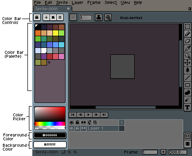

### What are the foreground/background colors?

The foreground color is the main color you'll be using to draw with. The background color is more of a secondary color that you may or may not use depending on your workflow. 

When using the color bar, <kbd>Left Click</kbd> is associated with the foreground color and <kbd>Right Click</kbd> is associated with the background color (e.g: left clicking selects the foreground color, rightclicking selects the background color). 

### What is the palette?

The palette is a list of colors (sometimes referred to as "palette entries") that you can use in your sprite. Colors can be added, changed, moved around, etc. You can use colors that aren't in the palette (unless your sprite is in Indexed mode, which will be talked about later). 

While the palette does not have a limit of how many entries it can have, palettes with more than `256` entries will not load correctly ([#3804](https://github.com/aseprite/aseprite/issues/3804)).

### What is the color picker?

The color picker (not to be confused with the eyedropper tool) is how you will create new colors to use in your sprite. By default, the color picker is set to "Color Tint/Shade/Tone" (HSV).

## Using the Color Picker and Foreground/Background Colors

To pick the foreground color from the color picker, <kbd>Left Click</kbd> and drag. To pick the background color, <kbd>Right Click</kbd> and drag. You can also change the foreground/background color by clicking on the foreground/background color buttons below the color pickers to open up the sliders menu; dragging the sliders menu into the sprite editor will make it stay open after unfocusing.

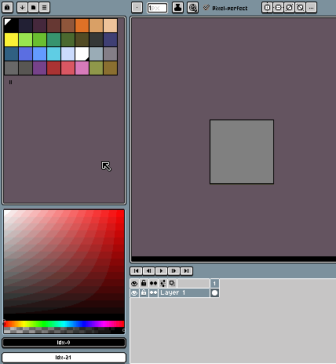

## Changing the Color Picker Type 

To change the type of color picker, go to the *Options*  menu above the palette. The color picker types are located in the fourth section. At the moment, there is only five options available:

* Color Tint/Shade/Tone (HSV)
* Color Spectrum (HSL)
* RGB Color Wheel
* RYB Color Wheel
* Normal Map Color Wheel

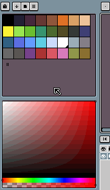

### Color Wheel Harmonies and Discrete Mode

The color wheel types have a few extra options: [color harmony](https://en.wikipedia.org/wiki/Harmony_(color)) modes and the *Discrete* mode toggle, which splits the color wheel into color sections. They can be acessed from the menu icon in the top righthand corner of the color picker.

The color harmony options allow for multiple colors to be picked in accordance with a harmonious color scheme. The options are:

* Without Harmonies (Default)
* Complementary
* Monochromatic
* Analogous
* Split-Complementary
* Triadic
* Tetradic
* Square

The colors that are picked are shown in the bottom right corner of the color wheel. <kbd>Right or Left Click</kbd>ing on one of the colors in the bottom right will change the foreground or background color to the clicked color. 

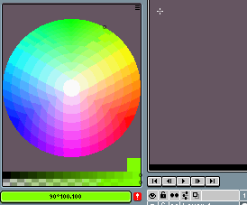

## Using the Palette

To add a color to the palette, click the red icon  next to the foreground or background color below the palette. If there isn't a red icon, that means the color has already been added to the palette.

<kbd>Left Click</kbd> a color to select it as the foreground color; <kbd>Right Click</kbd> a color to select it as the background color. To select multiple colors, <kbd>Right or Left Click</kbd> and drag. If a color has a black or white triangle in its top left corner, that means it is selected as the foreground color; if it has a smaller triangle in its bottom left corner, it is selected as the background color. 

To move a color or multiple colors, <kbd>Right or Left Click</kbd> the yellow selection outline and drag.

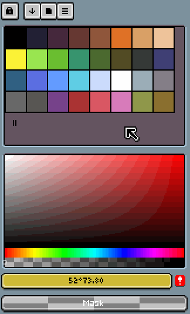

To duplicate a color or multiple colors, <kbd>Right or Left Click</kbd> the yellow selection outline while holding <kbd>Ctrl</kbd> and drag.

To quickly move between palette colors, you can press <kbd>[</kbd> to move back a color and <kbd>]</kbd> to move forward a color.

You can change the size of the palette entries by going into the *Options*  menu and selecting *Small Size*, *Medium Size*, or *Large Size*.

Clicking and dragging the two lines at the end of the palette can delete or add entries to the palette (the color of the added entries will be #000000).

### Editing colors

You can turn on *Edit Color* mode by pressing <kbd>A</kbd>, toggling the *lock button*  above the palette, or toggling the *Edit Palette* option in the *Options*  menu. When disabled (or "locked"), creating/picking a color will not affect the selected palette entry. When enabled (or "unlocked"), creating/picking a color will change the selected palette entry to the picked color.

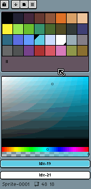

## Loading, Saving, and Creating Palettes

### Loading and Saving with Files

To load a palette from a file, open the *Options*  menu and then click on *Load Palette*. To save a palette to a file, open the *Options* menu and then click on *Load Palette*. 

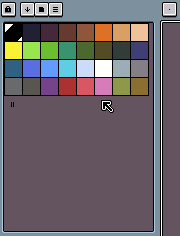

### Loading and Saving with Presets

A preset is a palette that is saved in the Aseprite [palettes folder](https://www.aseprite.org/docs/preferences-folder/) or that is added to Aseprite with an [extension](https://www.aseprite.org/docs/extensions/palettes/). Presets can be searched for and loaded within Aseprite, without the need to load a palette from a file.

To load a preset, open the *Presets*  menu above the palette and search for the name of the palette you want to load, then click on the palette or press the *Load* button in the bottom left corner.

To save a preset, open the *Options*  menu and click on *Save Palette as Preset*. The saved filename will be the name of palette in the *Presets* menu. 

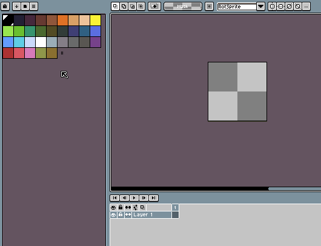

### Loading and Saving the Default Palette

The default palette is the palette that will be loaded when you create a new sprite. 

You can load the default palette by going to *Options*  and clicking *Load Default Palette*; you can set the default palette by going to *Options* and clicking *Save Palette As Default*.

### New Palette from Sprite

You can create a palette from the current sprite's colors by going to the *Options*  menu and opening the *New Palette from Sprite* menu.

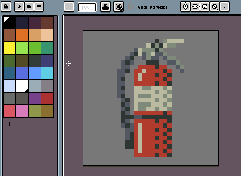

## Color Modes 

A sprite's color mode is how it represents and uses colors. There are three color modes in Aseprite: *RGB*, *Indexed*, and *Grayscale*.

### RGB Color Mode

The RGB color mode means that each pixel on the sprite maps directly to an RGB value. 

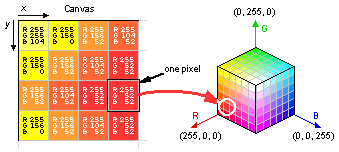

The RGB color mode is great for general use. When using the RGB color mode, you aren't constrained to the palette, so you can quickly create and draw with colors without needing to add them to the palette. You also don't need to use an index of your palette as a transparent color. 

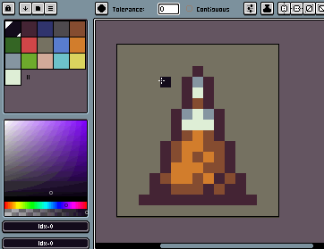

### Indexed Color Mode

The Indexed color mode means that each pixel is mapped to a palette index, and then that palette index maps to an RGB value. This means that if you change an index's color in the palette, the colors on the sprite with the index change too.

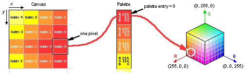

The Indexed color mode is best for sprites with a pre-defined palette. In Indexed mode, you are constrained to the colors in the palette, so you can't draw with a color that isn't in the palette without adding it to the palette first. 

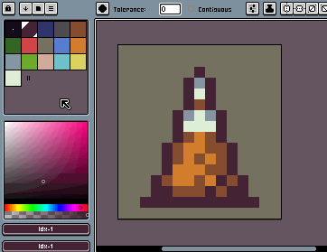

Indexed mode also needs an index to be used as the transparent color, which is indicated by a dot in the color's center. By default, the first (0th) index is the transparent color, but it can be changed in the *Sprite > Properties* menu.

### Grayscale Color Mode

The Grayscale color mode means that each pixel is a grayscale value from `0` to `255`. Useful for grayscale sprites.

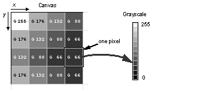

## Palette Sorting & Gradients

The *Sort & Gradients*  button contains options for palette sorting and for creating gradients.

### Sorting

There are eight different sorting options in the *Sort & Gradients*  menu:

* Sort by Hue
* Sort by Saturation
* Sort by Brightness (value)
* Sort by Luminance 
* Sort by Red (sort by RGBA red component)
* Sort by Green (sort by RGBA green component)
* Sort by Blue (sort by RGBA blue component)
* Sort by Alpha (sort by RGBA alpha component)

Below these are the *Ascending* and *Descending* toggle options, which sort them in ascending or descending order. 

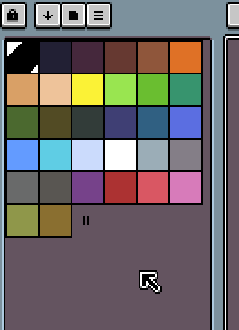

### Gradients

Aseprite allows you to create a gradient between two colors in the palette. You can do this by first making a selection from your start color to your end color. The colors between the two colors in the selection will be replaced by the gradient colors (so that means if you have three in between colors, your gradient will have five colors). After your colors are selected, open the *Sort & Gradients*  menu and select either *Gradient*, which makes a normal gradient between the two colors, or *Gradient by Hue* which makes a gradient that changes the hue more substantially. 

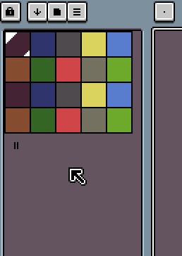

## FAQ/Troubleshooting

### Why didn't my palette load in order?

If you loaded your palette as a `.png` file and the palette is out of order, the "RGB to palette index mapping" setting is likely the problem. In the [Preferences](https://www.aseprite.org/docs/preferences#preferences) menu, under "Experimental", setting the RGB to palette index mapping to `Table RGB 5 bits + Alpha 3 bits` will make the palette load correctly.

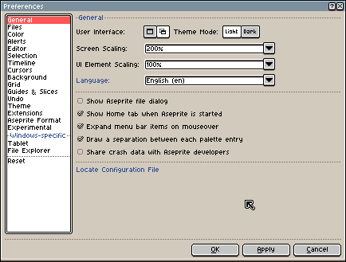

Alternatively, loading palettes as a `.gpl` or `.pal` file will load them correctly without the need to change any settings.

### Why can't I draw with colors not in the palette?

This is likely because your sprite [color mode](#color-modes) is set to *Indexed*, which doesn't allow you to draw with colors outside of the palette. You can fix it by setting your color mode to RGB with *Sprite > Color Mode > RGB Color*.

### Why can't I draw with the first color in the palette?

Your sprite [color mode](#color-modes) is likely set to *Indexed*, which requires a palette index to be used as the transparent color; by default, this is the first color (0th index) in the palette. 

You can fix it by doing one of the following: 
  * Setting your color mode to RGB with *Sprite > Color Mode > RGB Color*
  * Changing the transparent color index in the *Sprite > Properties* menu 
  * Making your first index a different color

### How can I change the color picker type?

See the [Changing the Color Picker Type](#changing-the-color-picker-type) section.

### How can I access the color sliders menu?

You can access the sliders menu by clicking on the foreground/background color icons below the color picker; dragging the sliders menu into the sprite editor will make it stay open after unfocusing. See [Using the Color Picker and Foreground/Background Colors
](#using-the-color-picker-and-foregroundbackground-colors) for a demo.

### How can I change the location of the color bar?

See the [Workspace Layout](https://www.aseprite.org/docs/workspace-layout/#moving-ui-elements) page.