# Article - Using Tilemaps and Tilesets
*By [crashtestjava](https://github.com/crashtestjava)*

 

This article will cover using tilemaps and tilesets in Aseprite. 

> *Tileset used: https://opengameart.org/content/monkey-lad-in-magical-planet*

### Table of Contents

* [What are Tiles, Tilemaps, and Tilesets?](#what-are-tiles-tilemaps-and-tilesets)
* [Creating a Tilemap Layer](#creating-a-tilemap-layer)
* [Creating a Tileset](#creating-a-tileset)
  * [Tileset Properties](#tileset-properties)
  * [The Tileset Palette](#the-tileset-palette)
  * [Exporting a Tileset](#exporting-a-tileset)
* [Drawing Tiles \& Draw Modes](#drawing-tiles--draw-modes)
  * [Draw Tiles](#draw-tiles)
  * [Draw Pixels](#draw-pixels)
  * [Tile Flipping](#tile-flipping)
* [Using the Grid](#using-the-grid)
  * [Grid Settings](#grid-settings)
  * [Snap to Grid](#snap-to-grid)
* [Tiling the Canvas](#tiling-the-canvas)
* [FAQ/Troubleshooting](#faqtroubleshooting)
  * [Is there support for isometric / hexagonal tiles?](#is-there-support-for-isometric--hexagonal-tiles)
  * [How do I import tilesets into Aseprite?](#how-do-i-import-tilesets-into-aseprite)
  * [How do I remove the first (transparent) index of a tileset?](#how-do-i-remove-the-first-transparent-index-of-a-tileset)
  * [How do I resize the tilemap grid (tile size)?](#how-do-i-resize-the-tilemap-grid-tile-size)
  * [How can I re-arrange the tileset without breaking the tilemap tiles?](#how-can-i-re-arrange-the-tileset-without-breaking-the-tilemap-tiles)
  * [How do I delete a tileset?](#how-do-i-delete-a-tileset)
  * [How can I layer two tiles on top of eachother?](#how-can-i-layer-two-tiles-on-top-of-eachother)
  * [How can I make the Color Bar show only the tileset?](#how-can-i-make-the-color-bar-show-only-the-tileset)

## What are Tiles, Tilemaps, and Tilesets?

When making a game, you'll usually need a level. Instead of drawing an entire level as one image, some games use tilemaps to make a level. A **tilemap** is similar to a regular sprite in the [Indexed color mode](https://www.aseprite.org/docs/color-mode#indexed), except instead of being divided into pixels on a grid, it's divided into **tiles** on a grid. A **tile** is simply an image with an index. Each space on the tilemap grid has an index which references a **tile**'s index in the **tileset**, which is a list of tiles. The indexes allow a tilemap's tiles to be easily changed and edited; if you change the tile image an index is pointing to, all of the tiles with that index will change too. 

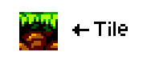

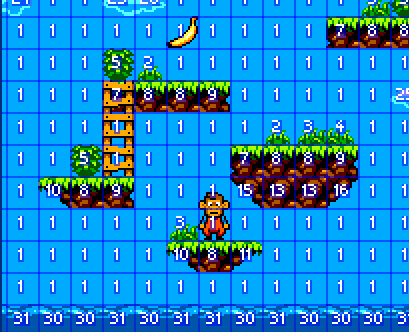

To recap:

* A **tileset** is a list of tiles.
* A **tile** is an image in the tileset with an index.
* A **tilemap** is a grid, with each space containing an index pointing to a tile in the tileset.

## Creating a Tilemap Layer

To use tilemaps and tilesets in Aseprite, you need to create a tilemap layer. Tilemap layers have most of the same features as regular layers, with the main difference being that it has special features for editing tiles. If you aren't familiar with regular layers and the timeline, it is recommended that you read the [Timeline and Animation Article](timeline-tutorial.md).

Tilemap layers can be created by going to *Layer > New... > New Tilemap Layer* or by pressing <kbd>Space+N</kbd>. You can also convert a regular layer into a tilemap layer with *Layer > Convert To > Tilemap*.

Tilemap layers can be identified in the timeline by the small tileset icon next to the layer name.

When you create a tilemap layer, a dialog will appear with two main properties:

* **Name**: The name of the tilemap layer.
* **Tileset**: The tileset to use for the tilemap, along with the tileset's properties. Choosing *New Tileset* will create a new tileset. Tileset properties will be covered in the [next section](#creating-a-tileset). 

## Creating a Tileset

Tilesets are created by creating tilemap layers. To create a new tileset, select *New Tileset* in the dropdown menu of the **Tilemap** property. Creating a tilemap layer will also show the [tileset properties](#tileset-properties) menu.

If you convert a layer to a tilemap layer with *Layer > Convert To > Tilemap*, the tileset will be made from the layer content.

A tilemap layer's tileset will appear in the color bar, under the palette.

### Tileset Properties

The tileset properties menu can be shown either by [creating a tilemap layer](#creating-a-tilemap-layer) or by pressing the *Tileset icon*  in the Layer Properties menu.

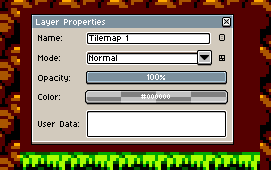

**Tileset** - Specifies the tileset to use/edit. When creating a tilemap layer, choosing *New Tileset* will create a new tileset with the tileset parameters.
* **Name** - The tileset name. Note that this is different from the tilemap layer name.
* **Grid Width** - The width, in pixels, of a tile; defaults to the [grid width](#using-the-grid). Note that this property **cannot be changed** after the tileset has been created.
* **Grid Height** - The height, in pixels, of a tile; defaults to the [grid height](#using-the-grid). Note that this property **cannot be changed** after the tileset has been created.
* *Advanced Options*
  * **Base Index** - The starting index of the tileset. Defaults to `1`.
  * **Allowed Flips** - Aseprite will *reuse* tiles that match another tile when flipped (in the `X`, `Y`, or `Diagonal` axes). See the [Tile Flipping](#tile-flipping) section for more details.

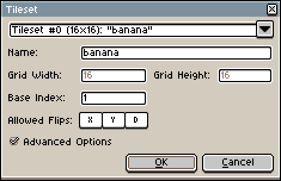

### The Tileset Palette

The tileset palette in the Color Bar works almost identically to the regular palette in Indexed mode. 

You can <kbd>Left Click</kbd> a tile to select it as the foreground tile, and <kbd>Right Click</kbd> a color to select it as the background tile. 

You can select multiple tiles by clicking and dragging, and you can move the selection by clicking and dragging the selection outline.

<kbd>Right Click</kbd>ing on the tileset button *tileset button*  above the palette will show only the selected palette (tileset or sprite).

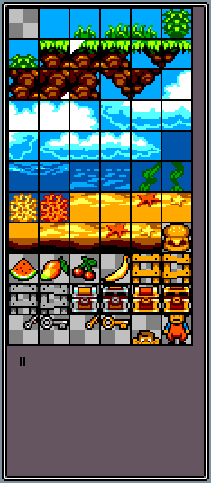

Moving around tiles in the tileset will have [the same effect as in Indexed mode](color-bar-tutorial.md#indexed-color-mode): the tilemap image will get messed up (because moving around the tiles changed what tiles the tilemap indexes point to). To fix this, press the "Remap Palette" button that appears below the palette, which will remap the indexes in the tilemap.

Similarly to how Indexed mode palettes have a transparent color entry, tilesets have a transparent or "Empty" tile, which is always at the start of a tileset. The transparent tile cannot be moved or changed.

For more detailed information on the palette, see the [Color Bar Article](color-bar-tutorial.md#using-the-palette) (most of the features are the same for the tileset palette).

### Exporting a Tileset

To export a tileset, go to *File > Export > Export Tileset*.

The exporting process is exactly the same as [*File > Export > Export Sprite Sheet*](https://www.aseprite.org/docs/sprite-sheet#export).

## Drawing Tiles & Draw Modes

When drawing on a tilemap layer, there are two main drawing modes: **Draw Tiles** and **Draw Pixels**. Drawing in draw tiles mode will draw the current tile onto the tilemap grid. Drawing in draw pixels mode will draw the current color on the *tile images*; it will alter the tile content. 

The draw mode can be changed by <kbd>Left Click</kbd>ing the *tileset button*  above the palette, pressing <kbd>Space+Tab</kbd>, or by selecting either the tileset palette or the sprite palette. 

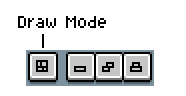

<kbd>Right Click</kbd>ing on the tileset button will change how the sprite palette and tileset palette are shown in the color bar; <kbd>Right Click</kbd>ing will toggle between showing a single palette and showing both palettes. <kbd>Left Clicking</kbd> will change which palette is selected.

### Draw Tiles

When draw tiles mode is selected, drawing will draw the current tile onto the tilemap grid. Most [tools](https://www.aseprite.org/docs/drawing/) can be used in draw tiles mode, like the brush tool, fill tool, rectangle tool, etc.

When drawing with tiles, they will be restricted to the tilemap grid.

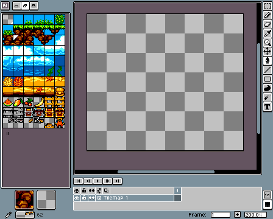

### Draw Pixels

Drawing in draw pixels mode will draw the current color on the *tile images*; it will alter the tile content. 

There are three sub-modes to the Draw Pixel mode, which control what happens when pixels are drawn on a tile: *Manual*, *Auto*, and *Stack*. The sub-mode buttons are located next to the draw mode button:

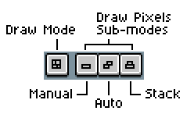

| Draw Pixels Sub-modes:
---
*  **Manual** (<kbd>Space+1</kbd>): Drawing on a tile will modify it. It will not create a new tile. 

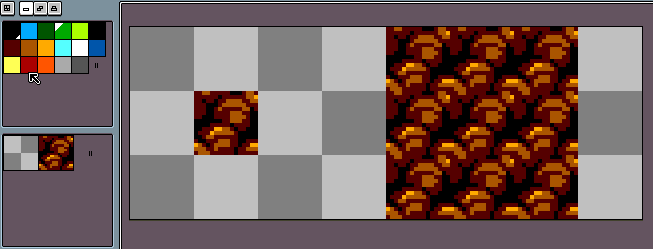

*  **Auto** (<kbd>Space+2</kbd>): Drawing on an exisiting tile creates a new tile. Drawing on the new tile will *modify* it until it is placed somewhere else in the tilemap. 

*  **Stack** (<kbd>Space+3</kbd>): Drawing on an exisiting tile creates a new tile. Drawing on the new tile will *create another new tile*. 

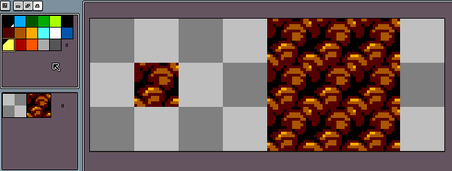

### Tile Flipping

Aseprite allows you to flip the image of tiles without making new ones. In the [tileset properties](#tileset-properties), the **Allowed Flips** property controls how tiles are flipped. **X** will allow tiles to be flipped on the `X` axis (horizontally), **Y** will allow tiles to be flipped on the `Y` axis (vertically), and **D** will allow tiles to be flipped diagonally. When making a new tile, Aseprite will check if the flipped version matches an existing tile. If it does, and flipping is enabled, it will use the index of the existing tile.

* To flip a tile in the `X` axis (horizontally), press <kbd>Space+X</kbd> or <kbd>Space+H</kbd>.
* To flip a tile in the `Y` axis (vertically), press <kbd>Space+Y</kbd> or <kbd>Space+V</kbd>.
* To flip a tile diagonally, press <kbd>Space+D</kbd>.

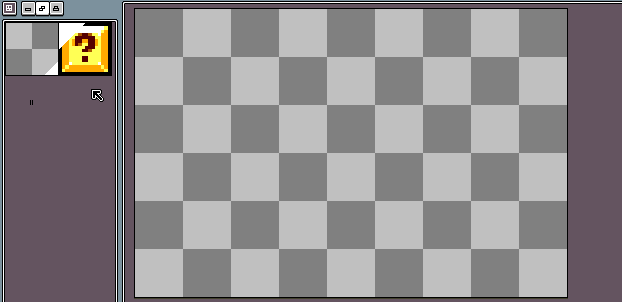

## Using the Grid

Aseprite has a grid function that shows gridlines, which can be useful when using tilemaps.

To show the grid, go to *View > Show > Grid* or press <kbd>Ctrl+'</kbd>. By default, the grid is broken up into `16x16` squares, but it can be changed in the [grid settings](#grid-settings).

When using a [selection tool](https://www.aseprite.org/docs/selecting/), <kbd>Double Clicking</kbd> on a pixel on the canvas will select the grid space that it is in. The grid does not have to be visible for it to work.

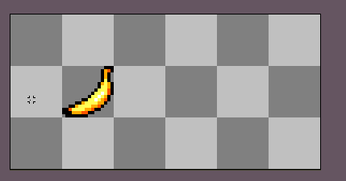

When the grid is being shown while a tilemap layer is selected, the grid size will automatically adjust to match the tile size.

### Grid Settings

The grid settings can be accessed with *View > Grid > Grid Settings*.

Settings:
* **X**: The `X` offset of the grid.
* **Y**: The `Y` offset of the grid.
* **Width**: The width of a grid space.
* **Height**: The height of a grid space.

You can also change the grid color and opacity in the [preferences](https://www.aseprite.org/docs/preferences/#grid).

### Snap to Grid

Snap to grid will snap the current brush/selection/etc to the grid. The grid does not have to be visible for it to work.

When [translating](https://www.aseprite.org/docs/move-selection/) (moving) a selection, holding <kbd>Alt</kbd> will snap it to the grid.

Selection snapping when Snap To Grid is enabled can be changed by going to *Edit > Preferences > Selection* and checking *Snap to Grid when the option is enabled*. 

Cursor snapping when Snap To Grid is enabled can be changed by going to *Edit > Preferences > Cursors* and checking *Snap to Grid when the option is enabled*. 

## Tiling the Canvas

Aseprite allows you to tile the canvas view in the `X` and `Y` axes, which can be useful when you want to make an individual tile without setting up and managing a tilemap. 

Canvas tiling can be controled by the *View > Tiled Mode* option:
* ***View > Tiled Mode > None*** disables canvas tiling
* ***View > Tiled Mode > Tiled in Both Axes*** tiles the canvas in both the `X` and `Y` axes
* ***View > Tiled Mode > Tiled in X axis*** tiles the canvas in only the `X` axis
* ***View > Tiled Mode > Tiled in Y axis*** tiles the canvas in only the `Y` axis

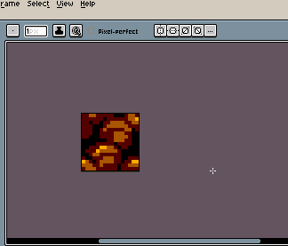

## FAQ/Troubleshooting

### Is there support for isometric / hexagonal tiles?

Aseprite does not currently support sometric / hexagonal tiles; it is a planned feature ([#720](https://github.com/aseprite/aseprite/issues/720), [#977](https://github.com/aseprite/aseprite/issues/977)).

### How do I import tilesets into Aseprite?

Aseprite currently does not have a way to cleanly import a tileset from a file ([#977](https://github.com/aseprite/aseprite/issues/977)), but you can import one by:
  1. Opening the tileset file in Aseprite
  2. Converting the layer to a tilemap layer with *Layer > Convert To > Tilemap*
  3. Creating another tilemap layer with *Layer > New... > New Tilemap Layer*, setting the **Tilemap** property to the tileset that was created in the last step
  4. Deleting the first layer

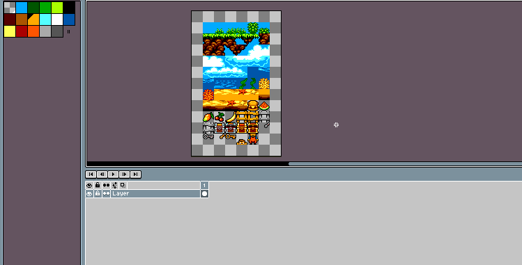

### How do I remove the first (transparent) index of a tileset? 

You can't change or move the first (transparent/empty) index in the tileset.

### How do I resize the tilemap grid (tile size)?

You can't resize a tileset's grid size after it's already been created. To get a tileset with a different size, you need to [create a new one](#creating-a-tileset).

### How can I re-arrange the tileset without breaking the tilemap tiles?

Moving around tiles in the tileset will have [the same effect as in Indexed mode](color-bar-tutorial.md#indexed-color-mode): the tilemap image will get messed up (because moving around the tiles changed what tiles the tilemap indexes point to). To fix this, press the "Remap Palette" button that appears below the palette, which will remap the indexes in the tilemap.

### How do I delete a tileset?

There isn't a clean way to delete a tileset, but you can delete a tileset by deleting all of the tilemap layers that use it. A tileset manager is a planned feature [#977](https://github.com/aseprite/aseprite/issues/977).

### How can I layer two tiles on top of eachother?

You can achieve this by making another tilemap layer with the same tileset. If you want the tiles to merge into one tile, you can copy a tile's image in Draw Pixels mode and paste it in over another tile.

### How can I make the Color Bar show only the tileset?

<kbd>Right Click</kbd> on the tileset button *tileset button*  above the palette. This will show only the selected palette (tileset or sprite), <kbd>Left Click</kbd>ing will toggle between the two. See [The Tileset Palette](#the-tileset-palette) section.
