# Article - The Timeline and Animation
*By [crashtestjava](https://github.com/crashtestjava)*

 

This article will cover the timeline, covering everything from the very basics to more advanced features.

### Table of Contents

* [What is the Timeline?](#what-is-the-timeline)
  * [What is a layer?](#what-is-a-layer)
  * [What are frames and cels?](#what-are-frames-and-cels)
* [Selecting and Moving](#selecting-and-moving)
* [Using Layers](#using-layers)
  * [Layer Menu](#layer-menu)
  * [Visibility and Locking](#visibility-and-locking)
  * [Layer Properties](#layer-properties)
  * [Blend Modes](#blend-modes)
  * [Background Layers](#background-layers)
  * [Reference Layers](#reference-layers)
  * [Groups](#groups)
* [Using Frames \& Cels](#using-frames--cels)
  * [Frame Menu](#frame-menu)
  * [Frame \& Cel Properties](#frame--cel-properties)
  * [Linked Cels](#linked-cels)
  * [Tags \& Tag Properties](#tags--tag-properties)
  * [Timeline Settings](#timeline-settings)
  * [Onion Skin](#onion-skin)
  * [Playback Controls](#playback-controls)
* [The Preview Window](#the-preview-window)
* [FAQ/Troubleshooting](#faqtroubleshooting)
  * [Why can't I paste in cels/frames more than once?](#why-cant-i-paste-in-celsframes-more-than-once)
  * [Why do frame numbers go back to 01 after reaching 99?](#why-do-frame-numbers-go-back-to-01-after-reaching-99)
  * [Why isn't the onion skin overlay appearing on the sprite?](#why-isnt-the-onion-skin-overlay-appearing-on-the-sprite)
  * [How can I change how many frames the onion skin shows?](#how-can-i-change-how-many-frames-the-onion-skin-shows)
  * [How can I hide the timeline?](#how-can-i-hide-the-timeline)
  * [How can I change the location of the timeline?](#how-can-i-change-the-location-of-the-timeline)
  * [How do I duplicate a selection to a new layer?](#how-do-i-duplicate-a-selection-to-a-new-layer)
  * [How do I create a reference layer?](#how-do-i-create-a-reference-layer)
  * [How can I delete tags?](#how-can-i-delete-tags)
  * [How do I turn off onion skin by default?](#how-do-i-turn-off-onion-skin-by-default)

## What is the Timeline?

The timeline contains the sprite's layers, cels, and frames. By default, the timeline is located at the bottom of the Aseprite window, below the sprite editor.

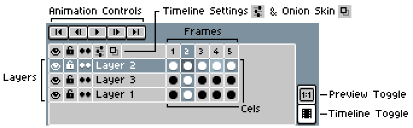

You can hide the timeline by going to *View > Timeline*, clicking the timeline toggle button  in the bottom right corner of the timeline, or by pressing <kbd>Tab</kbd>.

### What is a layer?

Layers are used to subdivide different parts of the sprite. Layers stack on top of each other *vertically* in the timeline. Layers will be shown above any other layers that are below it. A sprite's collection of layers is sometimes called the *layer stack* or *layer hierarchy*.

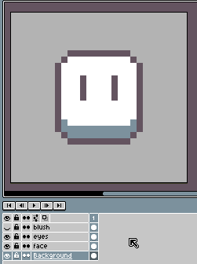

Aseprite also has special kinds of layers that are used for specific purposes, which will be covered in the [Using Layers](#using-layers) section.

### What are frames and cels?

A 2D animation is made up of multiple images in sequence. These images are called *frames*. 

In Aseprite, a frame is not just one image. Instead, each frame contains a set of images, **one for each layer**. These images are called *cels*. In other words, a cel is **the image of a layer at a certain frame**. The *active cel* is the current cel that is being shown/edited.

On the timeline, frames and cels are next to eachother *horizontally*. Animations are played from left to right.

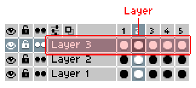

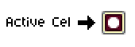

If you aren't creating an animation, your sprite will only have 1 frame.

## Selecting and Moving

Selecting an element (layer, frame, cel) will show a *yellow outline* around the selected element. Additionally, the active cel, selected layer, and selected frames will be highlighted. The active timeline selection is also sometimes called the timeline *range*.

By default, you can <kbd>Left Click</kbd> to select a single element in the timeline. You can select multiple elements by <kbd>Left Click</kbd>ing an element and dragging over the adjacent elements you want to select.

To add an element to the current selection, <kbd>Left Click</kbd> an element while holding <kbd>Shift</kbd>. Additionally, doing this while clicking on an element *inside* the selection will change the active cel without altering the selection. Keep in mind that the selection outline can be misleading, as it also surrounds unselected layers/frames/cels that are between two selected layers/frames/cels ([#5869](https://github.com/aseprite/aseprite/issues/5869)).

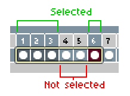

To move the selection, <kbd>Right Click</kbd> inside the selection and drag. Alternatively, you can move the selection by <kbd>Left Click</kbd>ing the selection outline and dragging.

To duplicate a selection, hold either <kbd>Ctrl</kbd> or <kbd>Alt</kbd> while moving the selection.

You can disable some of these functions in the Preferences menu, under [*Edit > Preferences... > Timeline > Timeline Range Selection*](https://www.aseprite.org/docs/preferences/#timeline).

When copying the timeline range, it will *not* be saved to the clipboard, and as a result, you cannot paste a copied range twice ([#2005](https://github.com/aseprite/aseprite/issues/2005)).

When pasting in *frames* copied with *Edit > Copy*, the frames will be pasted *before* the selected frame ([#2685](https://github.com/aseprite/aseprite/issues/2685)). 

## Using Layers

There are four kinds of layers in Aseprite: *Regular* layers, *Background* layers, *Reference* layers, and *Tilemap* layers. Aseprite does *not* have a "mask layer" or "effects layer", but they are both planned features ([#459](https://github.com/aseprite/aseprite/issues/459), [#5081](https://github.com/aseprite/aseprite/issues/5081)). This section will only cover the first three types of layers. The fourth type, the *Tilemap* layer, is covered in the [Using Tilemaps and Tilesets](tilemap-tutorial.md) article.

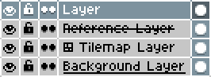

You can create a layer with *Layer > New.. > New Layer*, or with <kbd>Shift+N</kbd>.

To quickly move between layers, you can use the <kbd>Up</kbd> and <kbd>Down</kbd> arrow keys.

### Layer Menu

The layer menu, which is located at the top of the window in the [Menu Bar](https://www.aseprite.org/docs/menu-bar#menu-bar), contains options for manipulating layers and the layer stack. Some options may be disabled depending on the context. Additionally, <kbd>Right Click</kbd>ing on a layer or group will show a popup version of this menu, with some options missing.

* **Properties** (<kbd>F2</kbd>) - Shows the [layer properties](#layer-properties) menu. <kbd>Double Left Click</kbd>ing on a layer or group will also show this menu.
* **Visible** (<kbd>Shift+X</kbd>) - Toggles the [visibility](#visibility-and-locking) of the currently selected layer(s).
* **Lock Layers** - [Locks/unlocks](#visibility-and-locking) the currently selected layer(s).
* **Open Group** (<kbd>Shift+E</kbd>) - Expands/collapses the currently selected [group](#groups).
* *New...*
  * **New Layer** (<kbd>Shift+N</kbd>) - Creates a new layer above the selected layer. If the selected layer is in a group, it will make the new layer in the group.
  * **New Group** (<kbd>Alt+Shift+N</kbd>) - Creates a new group with the currently selected layer(s).
  * **New Layer via Copy** (<kbd>Ctrl+J</kbd>) - Copies the current selection content and pastes it into a new layer.
  * **New Layer via Cut** (<kbd>Ctrl+Shift+J</kbd>) - Cuts the current selection content and pastes it into a new layer.
  * **New Reference Layer from File** - Creates a new [reference layer](#reference-layers) from a file.
  * **New Tilemap Layer** (<kbd>Space+N</kbd>) - Creates a new tilemap layer above the selected layer.
* **Delete Layer** - Deletes the currently selected layers(s).
* *Convert To...*
  * **Background** - Converts the selected layer into a background layer.
  * **Layer** - Converts the selected layer into a layer.
  * **Tilemap** - Converts the selected layer into a tilemap layer.
* **Duplicate** - Duplicates the selected layer.
* **Merge Down** - Merges the selected layer with the layer below it.
* **Flatten** - Merges all of the layers in the layer stack.
* **Flatten Visible** - Merges all of the [visible](#visibility-and-locking) layers in the layer stack.

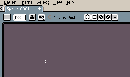

### Visibility and Locking

Layers can be made invisible. To toggle a layer's visibility, press <kbd>Shift+X</kbd>, toggle *Layer > Visible*, or click on the eye icon  to the left of the layer. Clicking the eye icon while holding <kbd>Alt</kbd> will hide all layers except the clicked one.  

Locking a layer prevents its content from being edited. To lock/unlock a layer, toggle *Layer > Lock Layers* or click the lock icon  located to the left of the layer. To lock/unlock all of the layers in the layer stack, click the topmost lock icon.

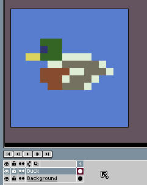

### Layer Properties

Every layer has properties that can be changed; some properties may be disabled depending on the layer type. You can access a layer's properties with *Layer > Properties*, pressing <kbd>F2</kbd>, or by <kbd>Double Left Click</kbd>ing on a layer.

* **Name** - The layer's name. 
* **Mode** - The [blend mode](#blend-modes) of the layer. 
* **Opacity** - The opacity of the layer, a value from `0-255` or `0%-100%` depending on [your settings](https://www.aseprite.org/docs/preferences#color). 

The following properties can be accessed by pressing the *User Data* button  next to the *Name* property:

* **Color** - The layer's color in the timeline. 
* **User Data** - Layer user data. Usually used for scripts/extensions.

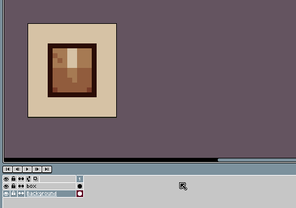

You can use the <kbd>Up</kbd> and <kbd>Down</kbd> arrow keys to quickly change the layer you're editing without closing the properties menu.

### Blend Modes

A layer's [*blend mode*](https://en.wikipedia.org/wiki/Blend_modes) is what determines how a layer *blends* with the layers below it. There are 19 different blend modes in Aseprite, which are listed below.

* Normal
* Darken
* Multiply
* Color Burn
* Lighten
* Screen
* Color Dodge
* Addition
* Overlay
* Soft Light
* Hard Light
* Difference
* Exclusion
* Subtract
* Divide
* Hue
* Saturation
* Color
* Luminosity

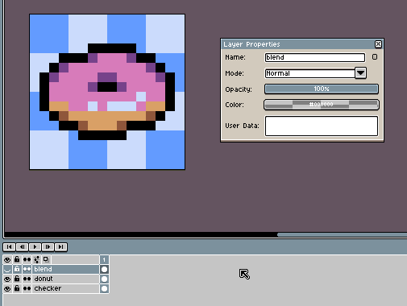

### Background Layers

Background layers are special layers that are used for blank backgrounds. Each sprite can only have one background layer, and the background layer will always be at the bottom of the layer stack. Background layers will have an *underlined name* in the layer stack, even if the background layer is renamed.

You can create a background layer by going to *Layer > Convert To... > Background* or by <kbd>Right Click</kbd>ing on a regular layer and clicking on *Convert To... > Background*.

Upon creation, background layers are filled with the current [background color](color-bar-tutorial.md). If the canvas size is expanded, the current background color will fill the expanded area. 

Background layers can be drawn on. If a portion of the background layer is erased, it will be replaced by the current background color.

### Reference Layers

Reference layers are special layers that can show an image at its full resolution (which usually a higher resolution than the canvas). Reference layers will have a *struck-through name* in the layer stack, even if the layer is renamed.

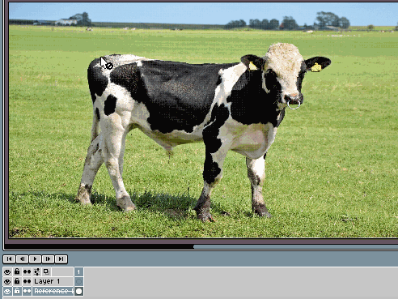
> Image used taken from [publicdomainpictures.net](https://www.publicdomainpictures.net/en/view-image.php?image=142181).

You can create a reference layer by going to *Layer > New... > New Reference Layer from File*. You can also create one from the clipboard with *Edit > Paste Special > Paste as New Reference Layer*.

### Groups

Aseprite allows you to group multiple layers together with groups. Groups share some features with layers: they can be hidden, locked, renamed, colored, etc.

You can create a new group by pressing <kbd>Alt+Shift+N</kbd> or going to *Layer > New... > New Group*. The currently selected layer(s) will be put inside the new group.

Groups can be collapsed or expanded by toggling *Layer > Open Group*, pressing <kbd>Shift+E</kbd>, or clicking on the folder icon  to the left of the group.

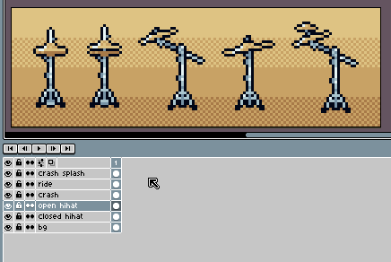

When using *Layer > Flatten* with a group selected, only the layers in the group will be flattened.

If the selected layer is in a group when creating a new layer, it will make the new layer in the group.

## Using Frames & Cels

Aseprite uses a very simple animation system. Frames are horizontal and are played from left to right, and each frame has a duration in milliseconds (not in FPS; but it is a planned feature [[#662](https://github.com/aseprite/aseprite/issues/662), [#4729](https://github.com/aseprite/aseprite/issues/4729)]). There isn't a set "project framerate", but you can easily set the duration of all frames with *Frame > Constant Frame Rate*.

You can create a new (duplicate) frame by going to *Frame > New Frame* or by pressing <kbd>Alt+N</kbd>. You can create a new *empty* frame by going to *Frame > New Empty Frame* or by pressing <kbd>Alt+B</kbd>.

To quickly move between frames, you can use the <kbd>Left</kbd> and <kbd>Right</kbd> arrow keys.

Holding <kbd>Ctrl+Mouse Wheel</kbd> while hovering over the timeline will show cel thumbnails. This can also be changed in the [timeline settings](#timeline-settings).

### Frame Menu 

The frame menu in the [Menu Bar](https://www.aseprite.org/docs/menu-bar#menu-bar) contains options for manipulating frames and cels on the timeline. Some options may be disabled depending on the context. <kbd>Right Click</kbd>ing on a frame or cel will show a popup version of this menu, with some options missing.

* **Frame Properties** (<kbd>P</kbd>) - Shows the [frame properties](#frame--cel-properties) menu. <kbd>Double Left Click</kbd>ing on a frame will also show this menu.
* **Cel Properties** - Shows the [cel properties](#frame--cel-properties) menu. <kbd>Double Left Click</kbd>ing on a cel will also show this menu.
* **New Frame** (<kbd>Alt+N</kbd>) - Creates a new (duplicate) frame after the selected frame.
* **New Empty Frame** (<kbd>Alt+B</kbd>) - Creates a new empty frame after the selected frame.
* **Duplicate Cel(s)** (<kbd>Alt+D</kbd>) - Duplicates the currently selected cels. This will replace the cels that are after the selection. 
* **Duplicate Linked Cel(s)** (<kbd>Alt+M</kbd>) - Duplicates the currently selected cels and [links the duplicates](#linked-cels). This will replace the cels that are after the selection. 
* **Delete Frame** (<kbd>Alt+C</kbd>) - Deletes the selected frame(s) from the timeline. 
* *Playback*
  * **Play Animation** (<kbd>Enter</kbd>) - Plays the animation.
  * **Play Preview Animation** (<kbd>Shift+Enter</kbd>) - Plays the animation in the [preview](#the-preview-window) window.
  * **Playback Speed 0.25x** - Sets the animation playback speed to 0.25x.
  * **Playback Speed 0.5x** - Sets the animation playback speed to 0.5x.
  * **Playback Speed 1x** - Sets the animation playback speed to 1x.
  * **Playback Speed 1.5x** - Sets the animation playback speed to 1.5x.
  * **Playback Speed 2x** - Sets the animation playback speed to 2x.
  * **Playback Speed 3x** - Sets the animation playback speed to 3x.
  * **Play Once** - When checked, playing the animation will only play it once. 
  * **Play All Frames (Ignore Tags)** - When checked, playing the animation will play all frames, ignoring tags.
  * **Play Subtags & Repetitions** - When checked, playing the animation will play the timeline's [tags](#tags--tag-properties), including their animation directions and repeats. Note that the *Play All Frames (Ignore Tags)* option takes priority over this option. 
  * **Rewind on Stop** - When checked, stopping the animation will go back to the starting frame. This can also be changed in the [preferences](https://www.aseprite.org/docs/preferences/#timeline).
* *Tags*
  * **Tag Properties** - Shows the [tag properties](#tags--tag-properties) menu of the currently selected tag. <kbd>Left Click</kbd>ing on a tag will also show this menu.
  * **New Tag** - Creates a new tag around the selected frames.
  * **Delete Tag** - Deletes the currently selected tag
* *Jump to*
  * **First Frame** (<kbd>Home</kbd>) - Selects the first frame in the timeline.
  * **Previous Frame** (<kbd>Left</kbd>) - Selects the frame before the currently selected frame.
  * **Next Frame** (<kbd>Right</kbd>) - Selects the frame after the currently selected frame.
  * **Last Frame** (<kbd>End</kbd>) - Selects the last frame in the timeline.
  * **First Frame in Tag** - Selects the first frame in the currently selected [tag](#tags--tag-properties).
  * **Last Frame in Tag** - Selects the last frame in the currently selected tag.
  * **Go to Frame** (<kbd>Alt+G</kbd>) - Opens a menu which selects an inputted frame or tag.
* **Constant Frame Rate** - Sets the frame duration of all of the frames in the timeline. 
  > **Tip:** *You can input math operations, e.g: `1000 / 24` (it will round to an integer)*
* **Reverse Frames** (<kbd>Alt+I</kbd>) - Reverses the order of the currently selected frames.

There are some additional options that are only available in the popup version of the menu (<kbd>Right Click</kbd>ing on a frame or cel):

* **Set Loop Section** *[Frame Only]* (<kbd>F2</kbd>) - Creates a [tag](#tags--tag-properties) around the selected frames with the name "Loop". If there is already a loop tag, it will move it to surround the current selection. Also located at *View > Set Loop Section*.
* **Delete** *[Cel Only]* - Deletes the currently selected cel(s).
* **Unlink** *[Cel Only]* - [Unlinks](#linked-cels) the currently selected cel(s).
* **Link Cels** *[Cel Only]* - [Links](#linked-cels) the currently selected cel(s).

### Frame & Cel Properties

Frames and cels both have properties menus.

The **frame properties** menu can be accessed with *Frame > Frame Properties*, pressing <kbd>P</kbd> or by <kbd>Double Left Click</kbd>ing on a frame. Frames only have one property: the **Duration** property, which sets the frame's length, in milliseconds.

The **cel properties** menu can be accessed with *Frame > Cel Properties* or by <kbd>Double Left Click</kbd>ing on a cel. 

* **Opacity** - The opacity of the cel, a value from `0-255` or `0%-100%` depending on [your settings](https://www.aseprite.org/docs/preferences#color). 
* **Z-Index** - Visually moves the cel image a specified amount of layers up or down. 

The following cel properties can be accessed by pressing the *User Data* button  next to the *Opacity* property:

* **Color** - The cel's color in the timeline. 
* **User Data** - Cel user data. Usually used for scripts/extensions.

### Linked Cels 

Linked cels are cels that share an image. A cel is just a layer's image at a certain frame; when cels are linked, they all share the same image across multiple frames.

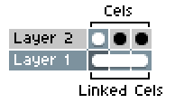

To link a selection of cels, <kbd>Right Click</kbd> inside the selection and click *Link Cels* in the popup menu; to unlink a selection of cels, click *Unlink Cels* in the popup menu.

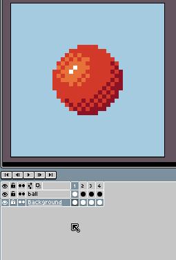

The *cel continuity* button  to the left of a layer will toggle if new cels will be linked or unlinked with the previous cel image.

### Tags & Tag Properties

Tags are a way to organize frames in the timeline, as well as change animation direction and repeats. 

You can create a new tag by going to *Frame > Tags > New Tag*. This will show the *Tag Properties* menu, which is also shown when using *Frame > Tag > Tag Properties*.

You can delete a tag by <kbd>Right Click</kbd>ing on a tag and clicking *Delete*. You can also use *Frame > Tags > Delete*, which will delete the tag that surrounds the currently selected frame.

**Tag Properties:**

* **Name** - The name of the tag.
* **From** - The first frame of the tag.
* **To** - The last frame of the tag. 
* **Animation Direction** - The animation direction:
  * Forward - Play frames in tag from left to right.
  * Reverse - Play frames in tag from right to left.
  * Ping-Pong - Play frames in tag from left to right, then right to left.
  * Ping-Pong Reverse - Play frames in tag from right to left, then left to right.
* **Repeat** - Repeats the tag a specified amount of time. If a number isn't specified, it will repeat an infinite amount of times.

The following tag properties can be accessed by pressing the *User Data* button  next to the *Name* property:

* **Color** - The tag's color in the timeline. 
* **User Data** - Tag user data. Usually used for scripts/extensions.

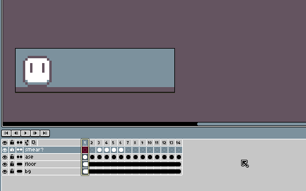

### Timeline Settings

The timeline settings are where some timeline-related settings are located. To open the menu, click on the settings menu button  above the layer stack. 

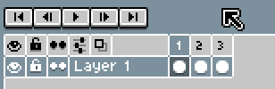

* **Position** - Controls the timeline's position in the Aseprite window. This can also be changed in [Workspace Layout](https://www.aseprite.org/docs/workspace-layout/) mode.
* **Frame Header**
  * *First Frame* - Controls what number the frames will start at (e.g: start at 0 or start at 1). 
* **Thumbnails** - Show cel images on the timeline.
  * *Thumbnail Size* - Controls the thumbnail size.
  * *Overlay Size* - Controls the overlay size (hovering over cels).
  * *Scale up to fit* - Scales up the cel image in the thumbnail to fit.
* **Onion Skin** - See the [Onion Skin](#onion-skin) section.

### Onion Skin

*Onion skinning* is a a tool used by animators to overlay a transparent version of the previous frame image onto the current frame, which can help with animating. Aseprite allows you to onion skin any number of frame images forward and backward. 

To enable onion skinning, go to *View > Show Onion Skin*, press <kbd>F3</kbd>, or click on the onion skin button  above the layer stack. 

To change how many frames the onion skin will show, move the corner handles inside of the frame number header.

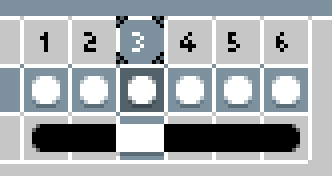

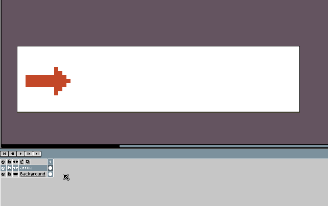

Onion skin settings can be edited in the [timeline settings](#timeline-settings):

* **Merge Frames / Red/Blue Tint** - Red/Blue Tint will tint the succeeding frame overlays blue and the preceding frame overlays red. Merge Frames will not tint the frame overlays.
* **Opacity** - Changes the opacity of the overlayed frame(s).
* **Opacity Step** - Changes the amount that the opacity decreases by each frame when the onion skin overlays multiple frames.
* **Loop through tag frames** - Onion skin sections that are outside of a [tag](#tags--tag-properties)'s bounds will loop around to the start of the tag.
* **Current layer only** - If enabled, the onion skin will only overlay cels from this layer.
* **Behind sprite / In front of sprite** - Shows the overlay in front of or behind the sprite.

* **Reset** - Resets the timeline settings to their defaults.
* **Set as Defaults** - Sets the default timeline settings for new sprites.

### Playback Controls

The *playback controls* are located at the very top of the timeline. They are button controls for these commands:

* *Frame > Jump To > First Frame*  (<kbd>Home</kbd>) - Selects the first frame in the timeline.
* *Frame > Jump To > Previous Frame*  (<kbd>Left</kbd>) - Selects the frame before the currently selected frame.
* *Frame > Playback > Play Animation*  (<kbd>Enter</kbd>) - Plays the animation. 
* *Frame > Jump To > Next Frame*  (<kbd>Right</kbd>) - Selects the frame after the currently selected frame.
* *Frame > Jump To > Last Frame*  (<kbd>End</kbd>) - Selects the last frame in the timeline.

Right-clicking on the play animation button  will show a popup version of the *Frame > Playback* menu.

## The Preview Window 

The preview window is a window that shows a preview of your sprite (think of it like a second editor window).  You can open the preview window by going to *View > Preview > Preview*, pressing <kbd>F7</kbd>, or by clicking on the *Preview button*  in the bottom right corner of the timeline (technically it's in the toolbar, so if you've changed your layout it might be in a different spot).

To play the timeline animation in the preview window, go to *Frame > Playback > Play Preview Animation*, press <kbd>Shift+Enter</kbd>, or click on the *play button*  in the preview window. 

The *center button*  next to the play button in the preview window will center the preview window view.

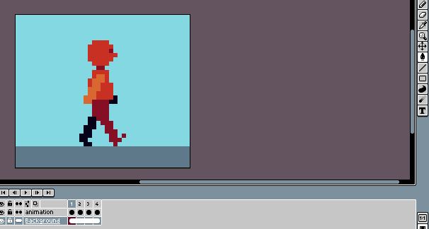

Right-clicking on the *play animation button*  will show a popup version of the *Frame > Playback* menu for the preview window.

If *View > Preview > Hide Other Layers* (<kbd>Shift+F7</kbd>) is checked, the preview window will only show the current layer.

If *View > Preview > Brush Preview*  is checked, the preview will show the brush cursor.

## FAQ/Troubleshooting

### Why can't I paste in cels/frames more than once?

This is a known issue. Copying timeline elements does not add it to the clipboard, so the workaround is that you can only paste a copied selection once ([#2005](https://github.com/aseprite/aseprite/issues/2005)).

### Why do frame numbers go back to 01 after reaching 99?

There isn't enough room. This is a known issue ([#3350](https://github.com/aseprite/aseprite/issues/3350)).

### Why isn't the onion skin overlay appearing on the sprite?

This is likely because your onion skin is behind the sprite. You can fix this by going to the [timeline settings](#timeline-settings) and selecting "In front of sprite".

### How can I change how many frames the onion skin shows?

To change how many frames the onion skin will show, move the corner handles that are inside of the frame number header.

### How can I hide the timeline?

You can hide the timeline by going to *View > Timeline*, clicking the timeline toggle button  in the bottom right corner of the timeline, or by pressing <kbd>Tab</kbd>.

### How can I change the location of the timeline?

You can change it with the **Position** property in the [Timeline Settings](#timeline-settings). 

### How do I duplicate a selection to a new layer?

Make a selection and press <kbd>Ctrl+J</kbd> (*Layer >New > New Layer via Copy*) to copy the selection to a new layer. Press <kbd>Ctrl+Shift+J</kbd> (*New Layer via Cut*) to cut the selection to a new layer.

### How do I create a reference layer?

See the [Reference Layers](#reference-layers) section. 

### How can I delete tags?

To delete a tag, <kbd>Right Click</kbd> on a tag and click on *Delete Tag*. You can also go to *Frame > Tags > Delete Tag*, which will delete the tag that surrounds the current frame.

### How do I turn off onion skin by default?

In any sprite, turn off onion skin and then go to the [timeline settings](#timeline-settings). Then, press *Set as Defaults* (keep in mind this will also set the other settings as the default). 