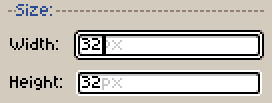
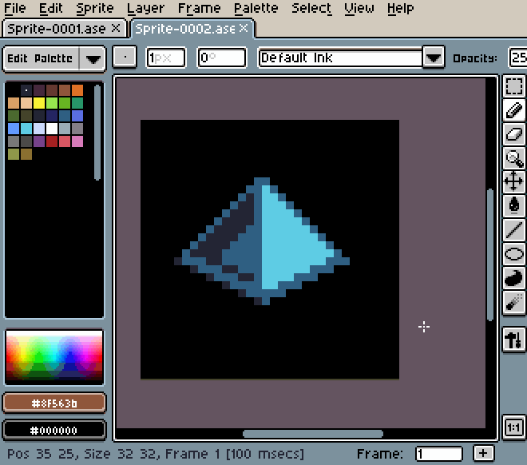

# UI Controls

Here we show some general information about controls/fields you will
find on the Aseprite User Interface (UI).

* [Sprite Editor](sprite-editor.md)
* [Timeline](timeline.md)
* [Workspace](workspace.md)
* [Color Bar](color-bar.md)

## Math in Number Fields

[Numeric fields](numeric-field.md) on Aseprite can evaluate simple math expressions:

## Drag and Drop Workspace Tabs

You can drag-and-drop tabs [in the workspace](workspace.md), duplicate
them using the <kbd>Ctrl</kbd> or <kbd>Alt</kbd> keys along with the
<kbd>Left Mouse Button</kbd>:

---

**SEE ALSO**

[Workspace](workspace.md)
