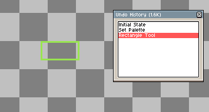
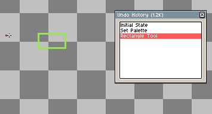

# Undo History

Undo history is a list of a sprite's states. A new state is saved each time an action is done to the sprite. When you use *Edit > Undo* (<kbd>Ctrl+Z</kbd>) or *Edit > Redo* 
(<kbd>Ctrl+Y</kbd>), you are moving back and forth through this list of states.

The undo history memory limit can be changed in the [preferences](preferences.md#undo) menu.

## Undo History Menu

The undo history menu shows the sprite's undo history. It can be accessed with *Edit > Undo History*. 

Clicking on an entry changes the sprite's current state to the one that was clicked. After an action on the sprite (creating a new entry), the state either adds to or replaces the states in front of it depending on the non-linear undo history setting.

### Non-Linear Undo History

By default the Undo History acts linearly: when Undo is used (which moves the current sprite state back one entry), the next action will erase all steps that can be redone. If this Non-Linear History is enabled and Undo is used, the next action will add the new sprite state to the list, keeping the old one intact. 

Non-Linear Undo History can be toggled on/off in the [preferences](preferences.md#undo) menu.

|Enabled|Disabled
|-|-
||

---

**SEE ALSO**

[Preferences](preferences.md#preferences) |
[Edit Menu](edit-menu.md#edit-menu)