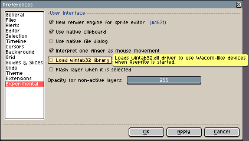
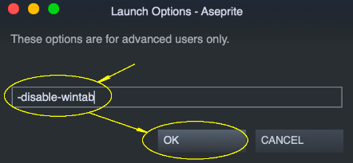

# Wintab

Wintab (`WinTab32.dll`) is an ancient API created by Wacom to
communicate tablet-like devices with Windows programs. Before Windows 8,
this was the "de facto" standard used to access pressure
information from tablets created by Wacom and other brands. Since
Windows 8, Microsoft introduced a new official API: the Pointer
API/Windows Ink.

Since **Aseprite v1.2.34** (and **v1.3-beta12**), as we've received a
lot of crash reports related to buggy third-party `WinTab32.dll`s,
we've switched to the Windows Pointer API by default. (The Wintab
option is still available from the [Tablet options](tablet.md).)

In previous versions of Aseprite, we tried to load this Wintab library
initially, but it could cause the program to crash randomly. Sometimes
you can solve this reinstalling drivers, restarting Windows, using the
Pointer API from [Tablet options](tablet.md), or just disabling Wintab
usage from *Edit > Preferences > Tablet* (or from *Edit > Preferences > Experimental* in older versions):

## Aseprite doesn't start

If you cannot even start the program, you can execute Aseprite with
the `-disable-wintab` parameter (available since Aseprite v1.2):

    "C:\Program Files\Aseprite\Aseprite.exe" -disable-wintab

This will avoid loading `WinTab32.dll` file. Your tablet might not
work correctly, but at least Aseprite can be executed and used with
your mouse/trackpad (or you can try the [Windows Pointer API](tablet.md)).

## Steam

On Steam you can add the `-disable-wintab` option in the Aseprite launch options:

1. Right-click Aseprite in your Steam library and open its "Properties":

   

2. Click the "Set Launch Options" button:

   

3. Add the `-disable-wintab` option and press "OK":

   

---

**SEE ALSO**

[Tablet](tablet.md) |
[Troubleshooting](troubleshooting.md)
