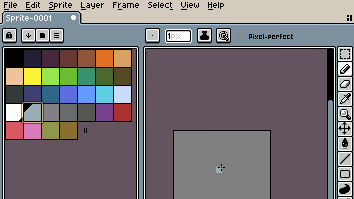
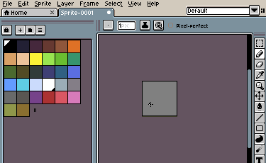
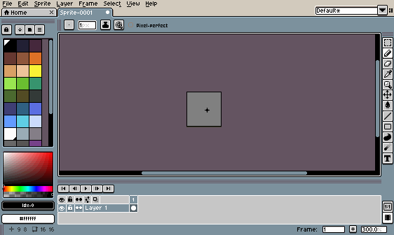

# Workspace Layout

Certain UI window elements can be moved (docked) to different positions in the window. To enter the Workspace Layout mode, you can press <kbd>Shift+W</kbd>, *View > Workspace Layout*, or click the *boxes icon* in the top right corner of the window. There are two native layouts: Default (Default Aseprite layout) and Mirrored Default (The Default layout but mirrored).

## Saving Layouts

Aseprite allows custom layouts to be saved. The dropdown menu in the top right corner of the window (next to the layout button) controls the selected layout. The first two layouts in the dropdown (the "Workspace Layout" section) are native Aseprite layouts: Default (Default Aseprite layout) and Mirrored Default (The Default layout but mirrored). Below this (the "User Layouts" section), clicking "New Layout" creates a new layout. When moving around UI elements, the changes are saved to the currently selected layout.

## Moving UI Elements

In the Workspace Layout mode, these UI elements can be moved:
- [Timeline](timeline.md)
- [Color Bar](color-bar.md)
- [Context Bar](context-bar.md)
- [Tool Bar](tool-bar.md)
- [Status Bar](status-bar.md)

Each element has three lines at the top or side of them. Clicking and dragging the three lines allows an element to be moved. When a dragged element is hovering over a valid place to move the element, an open space will appear, indicating that the element can be placed there. 

With the exception of the timeline, which can be moved to the top, bottom, left, and right in the window, vertical UI elements cannot be moved horizontally and horizontal UI elements cannot be moved vertically (e.g the toolbar cannot be moved to the top of the screen).  

---

**SEE ALSO**

[Workspace](workspace.md) |
[Customization](customization.md) 