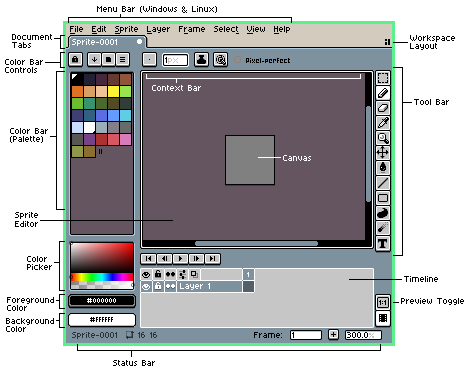

# Workspace

This is what the Aseprite workspace looks like in the Default layout:

The most important elements are the
[sprite editor](sprite-editor.md), the
[timeline](timeline.md), the [color bar and color pickers](color-bar.md),
and the [preview window](preview-window.md).
Other elements are the [menu bar](menu-bar.md) and
the [tool bar](tool-bar.md). The [status bar](status-bar.md) also gives you valuable
information about the current sprite.

The timeline is not visible by default; it can be made visible with
*View > Timeline* or the <kbd>Tab</kbd> key (It also pops up
automatically when you add a new frame or a new layer).

## Workspace Layout (Docking)

See the [Workspace Layout](workspace-layout.md#workspace-layout) section.

## Drag and drop tabs

You can drag-and-drop tabs to any side of the sprite editor window or
duplicate them using the <kbd>Ctrl</kbd> or <kbd>Alt</kbd> keys along
with the <kbd>Left Mouse Button</kbd>:

---

**SEE ALSO**

[Color Bar](color-bar.md) |
[Context Bar](context-bar.md) |
[Sprite Editor](sprite-editor.md) |
[Status Bar](status-bar.md) |
[Tabs](tabs.md) |
[Timeline](timeline.md) |
[Tool Bar](tool-bar.md) |
[Menu Bar](menu-bar.md) |
[Workspace Layout](workspace-layout.md)
